  

  

### Senior Full-Stack Engineer · India 🇮🇳 · Remote

I design, build, and lead production-grade, cloud-native systems on the **TypeScript / Node.js / React** stack — with a strong system-design foundation (**HLD/LLD**), distributed systems, and **AWS**. Over **3.5+ years** I've shipped platforms serving **10,000+ monthly active users** and led a **4-engineer team** through architecture, code review, and delivery.

I enjoy owning products end to end — especially **real-time applications** and **AI-assisted tools**. Recent work includes a real-time relationship app with Socket.IO chat & voice notes, an employee-management platform built from scratch, and Claude-powered product features.

**What I bring →** Full-stack ownership + system-design depth + team leadership — turning an idea into a reliable, deployed product.

`🟢 Open to remote senior full-stack roles`

  
  
  
  

## Selected work

  
  

  
  

## Languages, tools and skills

## A little more about my work

- **GoCouples** ([live](https://go-couples.aikazoo.com)) — real-time relationship app built as a TypeScript monorepo: React Native (Redux Toolkit / RTK Query) client, Fastify + Prisma + PostgreSQL backend, Socket.IO chat & voice notes, BullMQ/Redis jobs, FCM push, Cloudflare R2 media, and Claude-powered AI features. Dockerized with GitHub Actions CI/CD.
- **UI Wiki** ([live](https://uiwiki.co)) — SaaS design platform where designers copy production-ready components into Figma. Next.js + Node.js; Redis caching cut load time **~35%**; CI/CD with **99.8%** deployment success.
- **Employee Management platform** — architected from scratch for **3,000+ users**: clean MVC, authentication, **RBAC**, document management, clock-in/out, and approval workflows. Shipped on **AWS ECS/ECR** with Docker + CI/CD; lifted API throughput **~40%** via Redis caching and Node.js cluster mode.
- **AI Interview Assistant** — an LLM-driven tool that conducts and analyzes technical interviews.
- **Blogify** — full-stack blog with CRUD and a nested comment system (React · Node · Express).

## GitHub stats

  
  

## Achievements

- **1000+** problems solved on LeetCode · **~1600** rating (**top ~15%**).
- **2nd Runner-Up**, Cognida Coding Challenge.
- **20+** full-stack projects shipped on GitHub.

### Let's connect 🤝

I'm always interested in thoughtful product ideas, full-stack engineering, and practical AI applications — and I'm **open to remote senior full-stack roles**.

  
  

